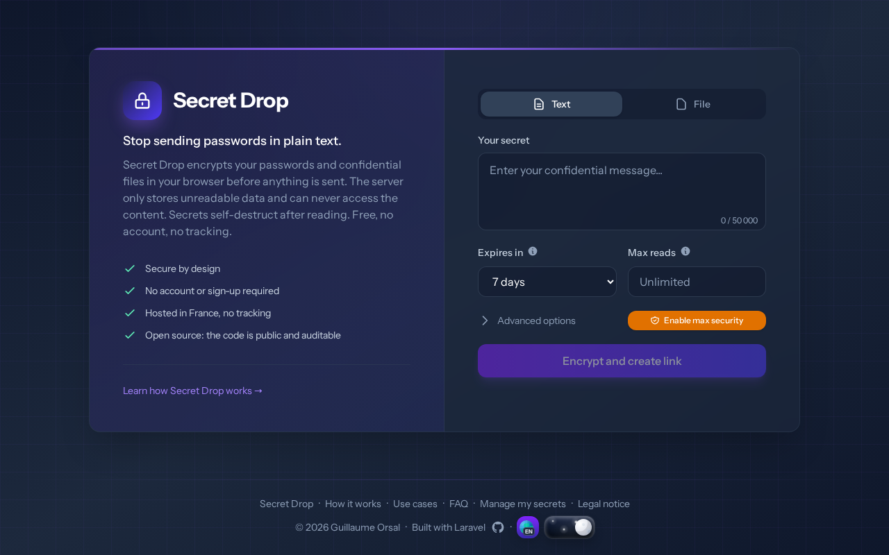

# Secret Drop

[](https://www.gnu.org/licenses/agpl-3.0)
[](https://laravel.com/)

Zero-knowledge secret sharing: end-to-end encrypted, self-destructing, open source.

**[Live demo](https://secret.orsal.fr)** · **[How it works](https://secret.orsal.fr/en/how-it-works)**

## Screenshot



## Why

A password you paste into an email or a Slack message sits in the mailboxes, backups and chat history of each provider it crosses, until someone deletes it. Secret Drop encrypts the secret in your browser before upload, so the server only holds encrypted bytes.

## How it works

1. You type a secret or pick a file in your browser.
2. Your browser generates a key and encrypts the content locally with AES-256-GCM (Web Crypto API).
3. The browser uploads the ciphertext. The server never receives the key, it has no way to decrypt it.
4. The key travels in the URL fragment (`#`). Browsers don't send the fragment to the server.
5. Your recipient opens the link, and their browser decrypts the secret locally.
6. The link stops working once the secret reaches its read limit or expiration date, and a scheduled job deletes it from the database.

## Features

- **Zero-knowledge**: without the key, the server has no way to decrypt your data
- **End-to-end encryption**: AES-256-GCM with keys generated in the browser
- **Self-destructing**: expiration and read limits set by the sender
- **Files up to 10 MB**, encrypted before upload
- **No account**: you manage your secrets through magic links sent by email, so there is no password to steal
- **11 languages**: fr, en, de, es, it, pt, nl, pl, ja, ko, ar
- **Admin dashboard**: revoke a secret or extend its expiration from a magic link
- **Stats dashboard**: pageviews, bots, devices, heatmaps, referrers
- **Strict CSP** with nonces, compatible with the Alpine.js CSP build
- **AGPL-3.0**: you can audit the whole source code

## Stack

Laravel 13 · PHP 8.4+ · Alpine.js 3 (CSP build) · Tailwind CSS 4 · Vite · MySQL/SQLite

## Quick start

```bash
git clone https://github.com/Gallyan/secret-drop.git
cd secret-drop
composer setup    # install deps, generate key, migrate, build
composer dev      # start dev server
```

## Tests

```bash
composer test                          # full suite (470+ tests)
php artisan test --filter=SecretTest   # run a single test
```

## Security

| What the server stores | What it never receives |
|------------------------|------------------------|
| Ciphertext (AES-256-GCM) | Plaintext content |
| IV, salt, metadata | Encryption key |
| Peppered email hash (HMAC-SHA256) | URL fragment (`#key`) |

Other protections: strict CSP with nonces, HSTS, log sanitization that strips tokens and secrets, rate limiting backed by a SHA-256 proof-of-work, a honeypot, daily per-IP limits, a file storage quota, CORS restriction and DKIM-signed emails.

## Deployment

```bash
composer install --no-dev --optimize-autoloader
npm ci && npm run build
php artisan migrate --force
php artisan optimize
```

The Laravel scheduler deletes expired secrets. Add it to your crontab:
```cron
* * * * * cd /path/to/secret-drop && php artisan schedule:run >> /dev/null 2>&1
```

`.env.production.example` lists the configuration options.

## CI/CD

GitHub Actions runs Pint (code style), Larastan (static analysis) and PHPUnit, then deploys over SSH. When a deployment changes public content, the pipeline pings search engines through IndexNow. You can also submit URLs on demand with a manual workflow.

## License

AGPL-3.0, see [LICENSE](LICENSE)

---

Built by [Guillaume Orsal](https://www.orsal.fr) · [Source on GitHub](https://github.com/Gallyan/secret-drop) · © 2026
